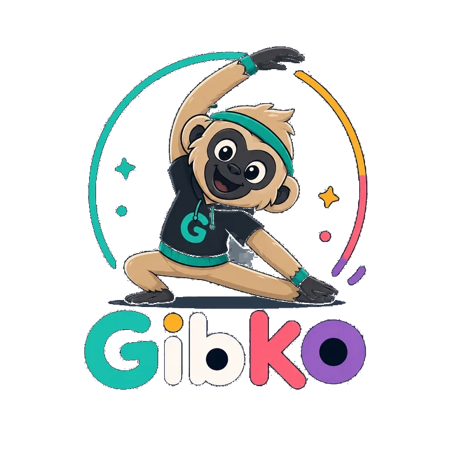

# Gibko



Gibko is a hobby PWA prototype that encourages kids around age 10 to do playful stretching missions with Gibko, a playful gibbon mascot. The first chapter is set in a rainforest.

The repository uses English for code, documentation, and agent instructions. User-facing copy is handled through localization files, with Polish as the default UI language and English prepared as a secondary option.

## Stack

- Vite
- React
- TypeScript
- vite-plugin-pwa
- React Router
- lucide-react
- Vitest

## Local Development

```powershell
npm install
npm run dev
```

## Verification

```powershell
npm test
npm run build
```

## Deployment

The app is configured for GitHub Pages as a project site:

```text
https://arekpalinski.github.io/gibko/
```

GitHub Actions builds and deploys the `dist` folder after pushes to `main`.

